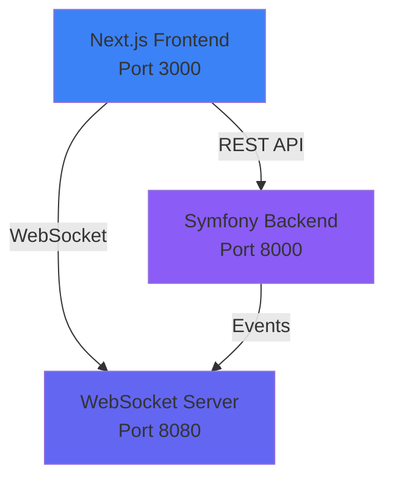
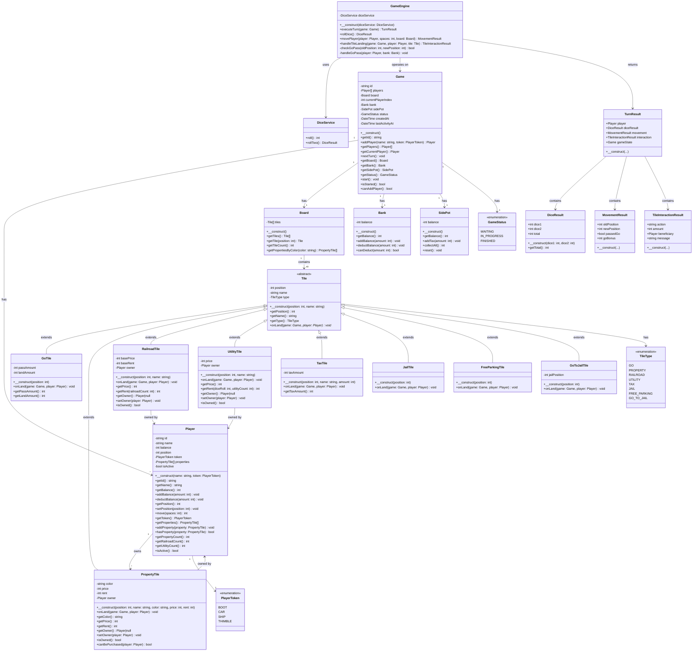

# Monopoly Game - Vereenvoudigde Versie

Een moderne implementatie van een vereenvoudigde Monopoly-game met PHP Symfony backend en Next.js frontend. De game state wordt volledig in-memory opgeslagen zonder database.

## 🎮 Features

- **Turn-by-turn gameplay** voor 2-4 spelers
- **Real-time updates** via WebSockets
- **Moderne UI** met clean, modern design
- **Smooth animaties** met Framer Motion
- **Docker support** - Start met één command
- **In-memory storage** - Geen database nodig

## 🏗️ Architecture Overview



## 📊 UML Class Diagram



## 🎲 Game Rules

### General
- 2-4 spelers per game
- Circular board met 40 posities
- Start balance: 1500 per speler
- Negative balances zijn toegestaan (game eindigt niet)

### Tiles
- **Go** (Position 0): 200 bij passeren, 400 bij landen
- **Properties**: Automatisch kopen als balance toereikend is
- **Railroads**: Rent verdubbelt per railroad (1x, 2x, 4x, 8x)
- **Utilities**: Rent = dice roll × (4 voor 1 utility, 10 voor 2)
- **Tax**: Gaat naar Side Pot
- **Free Parking**: Collecteer Side Pot
- **Go To Jail**: Verplaatst naar Jail (geen penalty)
- **Jail**: Geen effect (niet stuck)

### Turn Flow
1. Speler gooit 2 dobbelstenen
2. Token beweegt (position + sum) % 40
3. Check Go passing → +200
4. Handle tile landing (purchase/rent/tax/etc.)
5. Volgende speler aan de beurt

## 🚀 Quick Start

### Prerequisites
- Docker & Docker Compose
- (Optional) PHP 8.2+ en Composer voor lokale backend development
- (Optional) Node 20+ voor lokale frontend development

### One Command Start

```bash
# Clone or navigate to project directory
cd monopoly-game

# Start all services with Docker Compose
docker-compose up --build

# Or run in background
docker-compose up -d --build
```

De applicatie is beschikbaar op:
- **Frontend**: http://localhost:3000 - Game UI (Next.js)
- **Backend API**: http://localhost:8000 - REST API (Symfony)
- **WebSocket**: ws://localhost:8080 - Real-time updates

### Stoppen

```bash
# Stop services
docker-compose down

# Stop en verwijder volumes
docker-compose down -v
```

### Lokale Development (zonder Docker)

#### Backend
```bash
cd monopoly-backend

# Install dependencies
composer install

# Start REST API server
php -S localhost:8000 -t public/

# In een apart terminal venster: Start WebSocket server
php bin/console websocket:start
```

#### Frontend
```bash
cd monopoly-frontend

# Install dependencies
npm install

# Start development server
npm run dev
```

Open http://localhost:3000 in je browser

## 📁 Project Structure

```
.
├── monopoly-backend/          # Symfony PHP backend
│   ├── src/
│   │   ├── Entity/           # Domain models
│   │   ├── Service/          # Business logic
│   │   ├── Repository/       # In-memory storage
│   │   ├── Controller/       # REST API
│   │   ├── Websocket/        # WebSocket server
│   │   ├── DTO/              # Data Transfer Objects
│   │   └── Enum/             # Enumerations
│   └── config/
│
├── monopoly-frontend/         # Next.js TypeScript frontend
│   ├── app/                  # Pages (App Router)
│   ├── components/           # React components
│   ├── hooks/                # Custom hooks
│   └── lib/                  # Utilities & types
│
├── docker-compose.yml         # Docker orchestration
└── README.md                 # This file
```

## 🔌 API Endpoints

### REST API

| Method | Endpoint | Description |
|--------|----------|-------------|
| POST | `/api/games` | Create nieuwe game |
| GET | `/api/games/{id}` | Haal game state op |
| POST | `/api/games/{id}/players` | Voeg speler toe |
| POST | `/api/games/{id}/roll` | Voer turn uit (dobbelen) |
| GET | `/api/games/{id}/board` | Haal board state op |
| DELETE | `/api/games/{id}` | Beëindig game |

### WebSocket Events

#### Server → Client
- `game:updated` - Complete game state update
- `player:joined` - Nieuwe speler toegevoegd
- `turn:started` - Turn begonnen
- `dice:rolled` - Dobbelstenen gegooid
- `player:moved` - Speler verplaatst
- `property:purchased` - Property gekocht
- `rent:paid` - Huur betaald
- `turn:ended` - Turn afgerond

## 🎨 Design System

### Clean-Style Theme
- **Primary**: Blue gradient (#3b82f6 → #6366f1)
- **Secondary**: Purple accent (#8b5cf6)
- **Background**: Light (#f8fafc) / Dark (#0f172a)
- **Cards**: Glassmorphism met backdrop blur
- **Animations**: Framer Motion smooth transitions

### UI Components
- Circular game board met 40 tiles
- Animated player tokens
- 3D dice roll animation
- Real-time balance updates
- Property cards met hover states
- Toast notifications

## 🛠️ Technology Stack

### Backend
- **Framework**: Symfony 6.4
- **Language**: PHP 8.2
- **WebSocket**: Ratchet
- **Storage**: In-memory (PHP arrays)

### Frontend
- **Framework**: Next.js 14 (App Router)
- **Language**: TypeScript
- **State**: Zustand
- **UI**: Tailwind CSS + shadcn/ui
- **Animations**: Framer Motion
- **Icons**: Lucide React

## 📝 Development Notes

- Alle code bevat **PHPDoc/JSDoc comments**
- **Type hints** overal gebruikt
- **Strict mode** enabled
- **Hot reload** in development mode
- **Auto cleanup** van inactive games (2 uur)

## 📄 License

MIT License - Vrij te gebruiken voor educatieve doeleinden.

---

**Made with ❤️ using Symfony, Next.js, and Docker**

