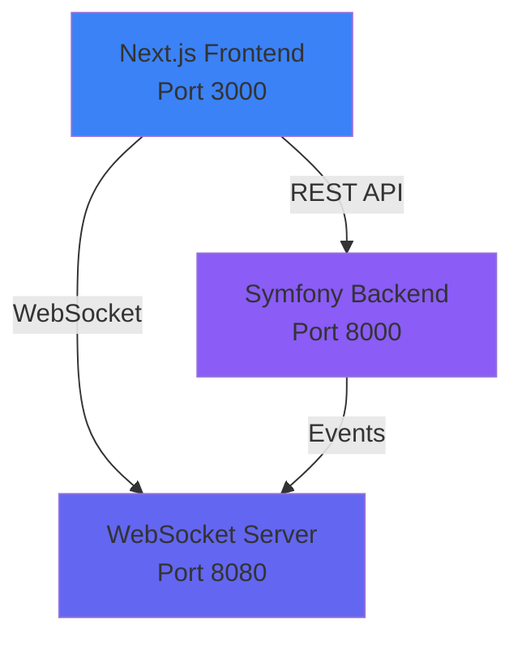

# 🎲 Monopoly Game

Een moderne Monopoly implementatie met PHP Symfony backend en Next.js frontend, volledig in-memory met real-time WebSocket updates.

## 🏗️ Architectuur



## ✨ Features

- 🎮 **Turn-by-turn gameplay** - Klassiek Monopoly spel met volledige spelregels
- 💾 **In-memory state** - Geen database nodig, alle game state in geheugen
- 🔄 **Real-time updates** - WebSocket integratie voor live game updates
- 🎨 **Clean, modern design** - Responsive UI met smooth animaties
- 🐳 **Docker ready** - Complete setup met één command
- 📡 **RESTful API** - Voor game management en turn execution
- 🚀 **WebSocket server** - Voor real-time game events

## 🚀 Quick Start

### Met Docker (Aanbevolen)

```bash
# Clone de repository
git clone <repository-url>
cd monopoly-game

# Start alle services
docker-compose up -d

# Bekijk logs (optioneel)
docker-compose logs -f
```

De applicatie draait nu op:
- **Frontend**: http://localhost:3000
- **Backend API**: http://localhost:8000
- **WebSocket**: ws://localhost:8080

### Stoppen

```bash
docker-compose down
```

## 🛠️ Lokale Development

### Backend (PHP Symfony)

```bash
cd monopoly-backend
composer install
php bin/console websocket:start  # WebSocket server
php -S localhost:8000 -t public/  # HTTP server
```

### Frontend (Next.js)

```bash
cd monopoly-frontend
npm install
npm run dev
```

## 📁 Project Structuur

```
monopoly-game/
├── monopoly-backend/          # Symfony backend
│   ├── src/
│   │   ├── Controller/       # REST API endpoints
│   │   ├── Entity/          # Game entities (Player, Tile, etc.)
│   │   ├── Service/         # Game logic (GameEngine, DiceService)
│   │   ├── DTO/             # Data Transfer Objects
│   │   ├── Repository/      # In-memory game storage
│   │   ├── Websocket/       # WebSocket server
│   │   └── Command/         # Console commands
│   └── config/              # Symfony configuratie
│
├── monopoly-frontend/         # Next.js frontend
│   ├── app/                 # Next.js App Router
│   ├── components/          # React components
│   ├── hooks/               # Custom hooks (WebSocket, GameState)
│   └── lib/                 # Utilities & API client
│
└── docker-compose.yml        # Docker orchestration
```

## 🎮 Game Features

### Tiles
- **Go** - Ontvang €200 bij passeren
- **Properties** - Koop en verzamel eigenschappen
- **Railroads** - Speciale eigenschappen met multiplier rent
- **Utilities** - Rent gebaseerd op dobbelsteenworp
- **Tax** - Betaal belasting
- **Jail** - Gevangenis tile
- **Go To Jail** - Ga direct naar gevangenis
- **Free Parking** - Side pot verzameling

### Gameplay
- 🎲 Rol dobbelstenen en beweeg over het bord
- 🏠 Koop automatisch eigenschappen als je voldoende geld hebt
- 💰 Betaal huur aan andere spelers
- 🎁 Free Parking side pot
- 🏦 Bank balans management

## 🔌 API Endpoints

### Game Management
- `POST /api/games` - Maak nieuw spel
- `GET /api/games/{id}` - Haal game state op
- `POST /api/games/{id}/join` - Join een spel
- `POST /api/games/{id}/start` - Start het spel
- `POST /api/games/{id}/turn` - Speel een turn

### WebSocket Events
- `game_updated` - Game state veranderd
- `player_joined` - Speler joined game
- `turn_completed` - Turn afgerond
- `game_started` - Game gestart

## 🧪 Tech Stack

### Backend
- PHP 8.2
- Symfony 6
- Ratchet (WebSocket)
- In-memory storage

### Frontend
- Next.js 14 (App Router)
- TypeScript
- Tailwind CSS
- Framer Motion (Animaties)
- Zustand (State Management)

### DevOps
- Docker & Docker Compose
- Multi-stage builds
- Hot reload tijdens development

## 📝 Development Notes

- Game state is volledig in-memory (geen persistence tussen restarts)
- WebSocket connecties worden automatisch opnieuw verbonden
- CORS is geconfigureerd voor local development
- Alle code bevat uitgebreide comments

## 📄 License

MIT

## 👤 Author

Ontwikkeld met ❤️ voor Monopoly fans
