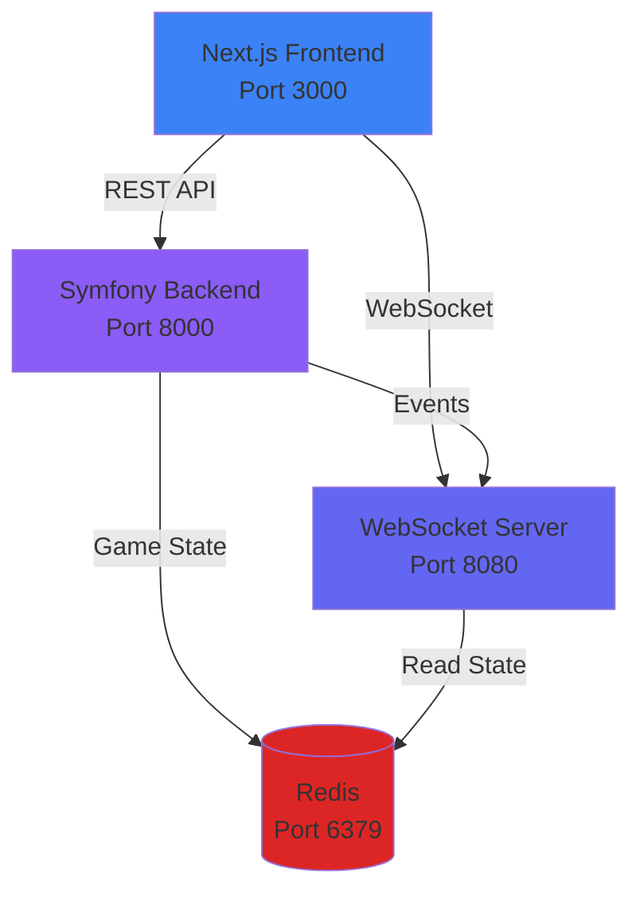
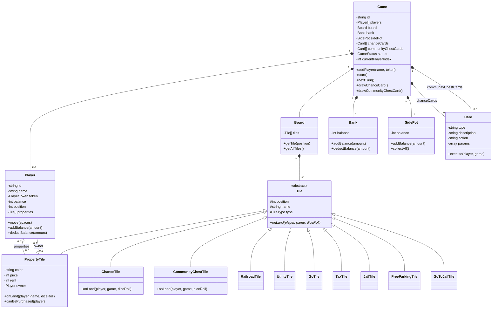

# 🎲 Monopoly Game

Een moderne Monopoly implementatie met PHP Symfony backend en Next.js frontend, volledig in-memory met real-time WebSocket updates.

## 🏗️ Architectuur

### Systeem Architectuur


### UML Class Diagram (Backend Entities)


## ✨ Features

- 🎮 **Turn-by-turn gameplay** - Klassiek Monopoly spel met volledige spelregels
- 💾 **In-memory state** - Geen database nodig, alle game state in geheugen
- 🔄 **Real-time updates** - WebSocket integratie voor live game updates
- 🎨 **Clean, modern design** - Responsive UI met smooth animaties
- 🐳 **Docker ready** - Complete setup met één command
- 📡 **RESTful API** - Voor game management en turn execution
- 🚀 **WebSocket server** - Voor real-time game events

## 🚀 Quick Start

### Met Docker (Aanbevolen)

```bash
# Clone de repository
git clone <repository-url>
cd monopoly-game

# Start alle services
docker-compose up -d

# Bekijk logs (optioneel)
docker-compose logs -f
```

De applicatie draait nu op:
- **Frontend**: http://localhost:3000
- **Backend API**: http://localhost:8000
- **WebSocket**: ws://localhost:8080

### Stoppen

```bash
docker-compose down
```

## 🛠️ Lokale Development

### Backend (PHP Symfony)

```bash
cd monopoly-backend
composer install
php bin/console websocket:start  # WebSocket server
php -S localhost:8000 -t public/  # HTTP server
```

### Frontend (Next.js)

```bash
cd monopoly-frontend
npm install
npm run dev
```

## 📁 Project Structuur

```
monopoly-game/
├── monopoly-backend/          # Symfony backend
│   ├── src/
│   │   ├── Controller/       # REST API endpoints
│   │   ├── Entity/          # Game entities (Player, Tile, etc.)
│   │   ├── Service/         # Game logic (GameEngine, DiceService)
│   │   ├── DTO/             # Data Transfer Objects
│   │   ├── Repository/      # In-memory game storage
│   │   ├── Websocket/       # WebSocket server
│   │   └── Command/         # Console commands
│   └── config/              # Symfony configuratie
│
├── monopoly-frontend/         # Next.js frontend
│   ├── app/                 # Next.js App Router
│   ├── components/          # React components
│   ├── hooks/               # Custom hooks (WebSocket, GameState)
│   └── lib/                 # Utilities & API client
│
└── docker-compose.yml        # Docker orchestration
```

## 🎮 Game Features

### Tiles
- **Go** - Ontvang €200 bij passeren
- **Properties** - Koop en verzamel eigenschappen
- **Railroads** - Speciale eigenschappen met multiplier rent
- **Utilities** - Rent gebaseerd op dobbelsteenworp
- **Chance** 🎲 - Trek een Kans kaart (7 verschillende)
- **Community Chest** 💰 - Trek een Algemeen Fonds kaart (7 verschillende)
- **Tax** - Betaal belasting
- **Jail** - Gevangenis tile
- **Go To Jail** - Ga direct naar gevangenis
- **Free Parking** - Side pot verzameling

### Gameplay
- 🎲 Rol dobbelstenen en beweeg over het bord
- 🏠 Koop automatisch eigenschappen als je voldoende geld hebt
- 💰 Betaal huur aan andere spelers
- 🎴 Trek Kans en Algemeen Fonds kaarten
- 🎁 Free Parking side pot verzameling
- 🏦 Bank balans management
- ⚡ Real-time updates via WebSocket
- 🎯 Volledig Nederlands met tooltips

## 🎨 Design Patterns & Architecture

### Backend Design Patterns
1. **Repository Pattern** (`GameRepository`)
   - Abstractie over Redis storage
   - Clean data access layer

2. **Strategy Pattern** (`Card.execute()`)
   - Verschillende card acties (collect, pay, move, etc.)
   - Polymorphism voor card behavior

3. **Template Method** (`Tile.onLand()`)
   - Abstract base class met concrete implementations
   - Elke tile type heeft eigen onLand logic

4. **Factory Pattern** (`Board.__construct()`)
   - Board creëert alle tiles
   - Centralized tile initialization

5. **Service Layer** (`GameEngine`, `DiceService`)
   - Business logic gescheiden van controllers
   - Herbruikbare game logic

### SOLID Principles
✅ **Single Responsibility**: Elke class heeft 1 doel  
✅ **Open/Closed**: Tiles extendable via inheritance  
✅ **Liskov Substitution**: Alle Tile types vervangbaar  
✅ **Interface Segregation**: Kleine, focused interfaces  
✅ **Dependency Inversion**: Controllers depend on abstractions  

### Clean Code Practices
- 📝 Uitgebreide comments in Nederlands
- 🏷️ Type hints overal (PHP 8.2)
- 🎯 Descriptive method names
- 🧪 Defensive programming (input validation)
- 🔒 Rate limiting & security
- 🚫 No magic numbers/strings

## 🔌 API Endpoints

### Game Management
- `POST /api/games` - Maak nieuw spel
- `GET /api/games/{id}` - Haal game state op
- `POST /api/games/{id}/join` - Join een spel
- `POST /api/games/{id}/start` - Start het spel
- `POST /api/games/{id}/turn` - Speel een turn

### WebSocket Events
- `game_updated` - Game state veranderd
- `player_joined` - Speler joined game
- `turn_completed` - Turn afgerond
- `game_started` - Game gestart

## 🧪 Tech Stack

### Backend
- **PHP 8.2** - Modern PHP met type hints, enums, attributes
- **Symfony 6** - Volwassen framework, dependency injection, routing
- **Ratchet** - Pure PHP WebSocket library, geen Node.js nodig
- **Redis** - Persistent in-memory storage, sneller dan APCu
- **Predis** - PHP Redis client, native type support

### Frontend
- **Next.js 14 (App Router)** - React framework, SSR, RSC ready
- **TypeScript** - Type safety, beter onderhoudbaar
- **Tailwind CSS** - Utility-first, snel prototypen, klein bundle
- **Framer Motion** - Smooth animaties, declarative API
- **Zustand** - Lightweight state management, geen boilerplate
- **react-confetti** - Winnaar celebratie

### DevOps
- **Docker & Docker Compose** - Reproducible environments
- **Multi-stage builds** - Kleinere images, sneller deployen
- **Hot reload** - Snelle development feedback loop

## 💡 Technologie Keuzes - Argumentatie

### Waarom PHP Symfony? 🐘
**Pro's:**
- ✅ **Volwassen ecosystem** - 15+ jaar ontwikkeling, battle-tested
- ✅ **Dependency Injection** - Clean architecture, makkelijk testen
- ✅ **Type safety** - PHP 8.2 strict types voorkomen bugs
- ✅ **OOP sterkte** - Perfect voor game entities (Player, Tile, Card)
- ✅ **Snelle development** - Console commands, auto-routing
- ✅ **Geen compile step** - Direct runnen, fast iteration

**Con's:**
- ❌ Minder hip dan Node.js/Go
- ❌ Threading moeilijker (maar niet nodig voor dit project)

**Conclusie**: Symfony is **perfect** voor object-heavy game logic met complexe entities en business rules.

### Waarom Ratchet (PHP WebSocket)? 🔌
**Pro's:**
- ✅ **Pure PHP** - Geen Node.js dependency, 1 taal stack
- ✅ **Symfony integratie** - Zelfde entities delen
- ✅ **Resource efficient** - Async I/O, event-driven
- ✅ **Direct Redis access** - Kan game state lezen

**Alternatief overwogen**: Mercure (Symfony native)
- ❌ Extra dependency (Mercure hub)
- ❌ More complex setup

**Conclusie**: Ratchet is **simpeler** en voldoende voor ons gebruik.

### Waarom Redis? 📦
**Pro's:**
- ✅ **Persistent in-memory** - Overleeft PHP request cycle
- ✅ **Cross-process** - Backend én WebSocket kunnen lezen
- ✅ **Atomic operations** - Race conditions voorkomen
- ✅ **TTL support** - Auto cleanup oude games
- ✅ **Proven at scale** - Production ready

**Alternatieven overwogen**:
1. **APCu** - ❌ Per-process, niet gedeeld tussen containers
2. **Files** - ❌ Lock contention, langzaam
3. **Database** - ❌ Overkill, te veel overhead

**Conclusie**: Redis is de **enige goede optie** voor shared in-memory state.

### Waarom Next.js 14? ⚛️
**Pro's:**
- ✅ **App Router** - Modern React patterns, nested layouts
- ✅ **Server Components** - Kleinere bundle, betere performance
- ✅ **Built-in routing** - File-based, geen extra config
- ✅ **TypeScript native** - Out-of-the-box support
- ✅ **Hot reload** - Instant feedback loop
- ✅ **SEO ready** - SSR voor homepage

**Alternatieven overwogen**:
1. **Vite + React Router** - ❌ Meer setup, geen SSR
2. **SvelteKit** - ✅ Goed, maar minder ecosystem
3. **Vue/Nuxt** - ✅ Goed, maar team kent React beter

**Conclusie**: Next.js is **industry standard** voor React apps.

### Waarom Zustand? 🐻
**Pro's:**
- ✅ **Minimale boilerplate** - Geen actions/reducers/providers
- ✅ **Hook-based** - Natuurlijk React patroon
- ✅ **Tiny bundle** (1kb) - Performance win
- ✅ **DevTools support** - Debugging makkelijk
- ✅ **TypeScript friendly** - Goede type inference

**Alternatieven overwogen**:
1. **Redux** - ❌ Veel boilerplate, overkill
2. **Context API** - ❌ Re-render issues, geen middleware
3. **Jotai** - ✅ Ook goed, maar atomic state niet nodig

**Conclusie**: Zustand is **perfect balance** tussen simpel en krachtig.

### Waarom Tailwind CSS? 🎨
**Pro's:**
- ✅ **Utility-first** - Snel prototypen, geen CSS files
- ✅ **Purge unused** - Kleine production bundle (< 10kb)
- ✅ **Design system** - Consistente spacing/colors
- ✅ **Responsive** - Mobile-first design makkelijk
- ✅ **No naming** - Geen BEM/SMACSS hoofdpijn

**Alternatieven overwogen**:
1. **CSS Modules** - ❌ Meer files, naming overhead
2. **Styled Components** - ❌ Runtime cost, geen SSR optimize
3. **Bootstrap** - ❌ Zwaar, moeilijk customizen

**Conclusie**: Tailwind is **fastest way** naar production-ready UI.

### Waarom Docker? 🐳
**Pro's:**
- ✅ **Reproducible** - Werkt overal hetzelfde
- ✅ **Dependencies isolated** - PHP, Redis, Node allemaal apart
- ✅ **Easy onboarding** - 1 command: `docker-compose up`
- ✅ **Production ready** - Zelfde container naar staging/prod
- ✅ **Multi-service** - Backend, Frontend, WebSocket, Redis

**Conclusie**: Docker is **industry standard** voor moderne development.

## 📝 Development Notes

- Game state is volledig in-memory (geen persistence tussen restarts)
- WebSocket connecties worden automatisch opnieuw verbonden
- CORS is geconfigureerd voor local development
- Alle code bevat uitgebreide comments

## 📄 License

MIT

## 👤 Author

Ontwikkeld met ❤️ voor Monopoly fans
